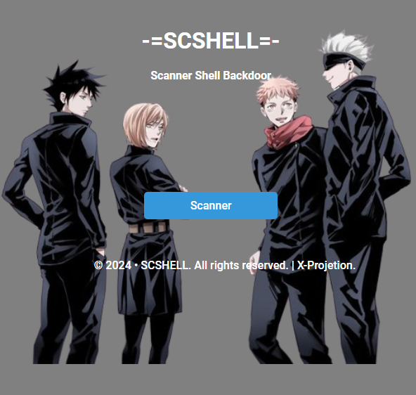

# SCSHELL
SCHSHELL is a tool for scanning shell backdoors in every folder on your website.

<h1 align="center">
  
  <br>
</h1>

<h4 align="center">scan for backdoor shells via local</h4>
# Feature
SCSHELL opens each folder and file then matches it with the query in the script.

Query : 
```
base64_encode
base64_decode
FATHURFREAKZ
eval
system
gzinflate
str_rot13
convert_uu
shell_data
getimagesize
magicboom
mysql_connect
mysqli_connect
basename
getimagesize
exec
shell_exec
fwrite
str_replace
mail
file_get_contents
url_get_contents
move_uploaded_file
symlink
substr
pathinfo
__file__
__halt_compiler
```
<br><br>
<h4 align="center">SCSHELL Made in ❤️ By X-Projetion</h4>
